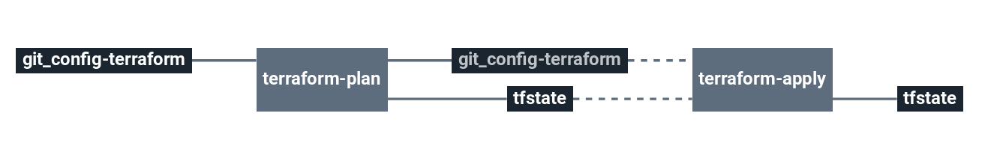

# stack-aks

This stack will create a Azure Kubernetes Service cluster with it's own dedicated network and one or more node pools.

  * Azure Virtual Network
  * Azure Kubernetes Service

# Architecture

  * **VNet**: Azure Virtual Network
  * **AKS**: Azure Kubernetes Service
  * **NP**: Azure Kubernetes Node Pools

# Requirements

In order to run this task, couple elements are required within the infrastructure:

  * Having an Azure Storage Account to store Terraform remote states [Here](https://docs.microsoft.com/en-us/azure/storage/common/storage-account-create?toc=%2Fazure%2Fstorage%2Fblobs%2Ftoc.json&tabs=azure-portal)

# Details

## Pipeline

> **Note** The pipeline contains a manual approval between terraform plan and terraform apply.
> That means if you trigger a terraform plan, to apply it, you have to go on terraform apply job
> and click on the `+` button to trigger it.

**Jobs description**

  * `terraform-plan`: Terraform job that will simply make a plan of the stack.
  * `terraform-apply`: Terraform job similar to the plan one, but will actually create/update everything that needs to. Please see the plan diff for a better understanding.
  * `terraform-destroy`: :warning: Terraform job meant to destroy the whole stack - **NO CONFIRMATION ASKED**. If triggered, the full project **WILL** be destroyed. Use with caution.

**Params**

|Name|Description|Type|Default|Required|
|---|---|:---:|:---:|:---:|

## Terraform

**Inputs**

|Name|Description|Type|Default|Required|
|---|---|:---:|:---:|:---:|

**Outputs**

| Name | Description |
|------|-------------|

